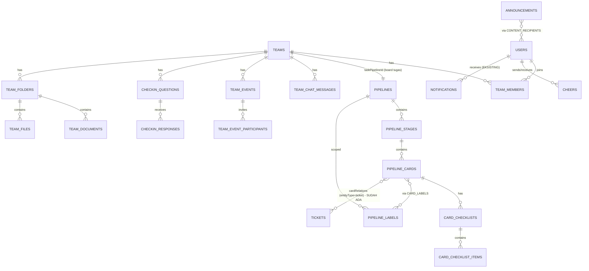

> **Versi:** 2.0 (adaptasi terintegrasi) &nbsp;|&nbsp; **Tanggal:** 17 Juli 2026 &nbsp;|&nbsp; **Untuk:** PT Arkanova Cipta Inovasi (JABNET Garut)
> **Basis:** PRD "Kolabo" v1.0 (reverse-engineering Cicle, 17 Juli 2026) **+ audit langsung codebase `jabnet-ftth-manager` v4.3.0** (LIVE di `workspace.jabnet.id`).
> **Perubahan fundamental vs PRD v1.0:** BUKAN aplikasi baru. Seluruh modul Cicle dibangun **di dalam JABNET Workspace yang sudah ada**, memakai stack, design system, auth, permission, dan engine pipeline yang sudah berjalan. PRD ini menandai setiap requirement dengan strategi eksekusi: **[REUSE]** (sudah ada, pakai), **[EXTEND]** (sudah ada, perluas), **[NEW]** (bangun baru), **[DROP]** (tidak dibangun, dengan alasan).
> **Target eksekusi:** Dokumen ini dirancang untuk langsung dikerjakan Claude Code / AI coding agent. Setiap requirement spesifik & testable.

# PRD: JABNET Teamspace - Modul Kolaborasi & Manajemen Tim di dalam JABNET Workspace

*(Teamspace = nama kerja modul; menggantikan placeholder "Kolabo". Target rilis: JABNET Workspace **v5.0**.)*

---

## 0. Ringkasan Keputusan Adaptasi (WAJIB DIBACA AGENT SEBELUM CODING)

Audit codebase v4.3.0 menunjukkan JABNET Workspace **sudah memiliki** sebagian besar fondasi yang PRD v1.0 rencanakan bangun dari nol. Keputusan per modul:

| # | Modul (PRD v1.0) | Strategi | Dasar di codebase eksisting |
|---|---|---|---|
| 1 | Autentikasi & profil (FR-1xx) | **[REUSE]** | Staff token auth, `users` table, ProfilePage, avatar, roles |
| 2 | Perusahaan multi-tenant (FR-2xx) | **[DROP]** sebagian | Single company. Kolom `mitraId` sudah ada di semua tabel (multi-tenant-lite) - cukup, JANGAN bangun company switcher |
| 3 | Struktur Tim/Workspace (FR-3xx) | **[NEW]** | Entitas `teams` baru; tapi board tugasnya = pipeline eksisting |
| 4 | Manajemen Tugas/Kanban (FR-4xx) | **[REUSE+EXTEND]** | Engine pipeline SUDAH LENGKAP: `pipelines`, `pipelineStages`, `pipelineCards`, multi-assignee, followers, komentar bertipe, attachment (card+comment), custom fields + conditional visibility, template, automation rules, capabilities per role, metrics. Gap yang dibangun: checklist, label berwarna, recurring, private card, cover, view List/Kalender/Tabel, Semua Tugas |
| 5 | Chat Grup (FR-5xx) | **[NEW]** | Belum ada; pola polling + pause-on-blur sudah jadi konvensi app |
| 6 | Pengumuman (FR-6xx) | **[EXTEND]** | `announcements` sudah ada (kategori, severity, pin, draft). Gap: penerima terpilih, toggle Rahasia, expiry otomatis, scoping per tim |
| 7 | Jadwal/Kalender (FR-7xx) | **[NEW]** | `SlaCalendarPage` ada sebagai precedent UI kalender; event tim + iCal feed dibangun baru |
| 8 | Pertanyaan/Check-in (FR-8xx) | **[NEW]** | Worker pattern ada (`billing-sync-worker`); pengiriman via **WhatsApp MPWA eksisting** - keunggulan yang Cicle tidak punya |
| 9 | Dokumen & File (FR-9xx) | **[NEW]** | Infra upload lengkap (`server/uploads.ts`, `multipart.ts`, `JABNET_UPLOAD_ROOT`) |
| 10 | Laporan Kinerja + AI (FR-10xx) | **[EXTEND]** | `/api/users/:id/stats` (productivity counters), `kpiSnapshots`, `pipelineMetrics` sudah ada. Gabungkan metrik tugas internal + metrik ops (tiket, lead, collection, canvassing) → laporan yang JAUH lebih terukur daripada Cicle |
| 11 | Log Aktivitas (FR-11xx) | **[REUSE]** | `auditLogs` + `pipelineCardActivity` + AuditLogPage sudah ada; tambah event types + filter tim |
| 12 | Notifikasi (FR-12xx) | **[EXTEND]** | `notifications` table + NotificationBell (poll 30s) sudah ada; tambah tipe baru |
| 13 | Cheers (FR-13xx) | **[NEW]** | Modul kecil, fase 3 |
| 14 | Pencarian Global (FR-14xx → penomoran lama 13xx) | **[EXTEND]** | Command Palette ⌘K sudah ada (40+ routes); tambah pencarian konten (tugas/dokumen/tim) |
| 15 | RBAC (FR-14xx) | **[REUSE+EXTEND]** | Permission system `none/read/write` + auto-migration + RolesPage matrix + `pipelineAccess` capabilities per role + `cardFilter` sudah ada. Tambah: permission keys baru + role per-tim (manager) + item "Rahasia" |
| 16 | Billing & Langganan (FR-15xx) | **[DROP]** | Aplikasi internal self-hosted - justru tujuannya menghilangkan biaya langganan SaaS. Tidak ada monetisasi |
| 17 | Open API (FR-16xx) | **[EXTEND]** | `/api/public/v1/*` + API key scoped + rate limit + usage log sudah ada; tambah scope `teamspace:read` |

**Konsekuensi strategis:** estimasi PRD v1.0 (MVP 4-6 minggu, parity 3-4 bulan) terpangkas menjadi **Fase 1 ≈ 2-3 minggu, full parity ≈ 2 bulan**, karena ±60% fondasi sudah production-tested.

**Aturan emas untuk agent:**
1. **JANGAN membangun engine Kanban kedua.** Board tugas tim = pipeline eksisting yang dimiliki tim (lihat §7 FR-4xx dan §10).
2. **JANGAN menambah stack baru** (Next.js/Prisma/PostgreSQL/Soketi dari PRD v1.0 DIBATALKAN - lihat §11).
3. **WAJIB pakai design system eksisting** (`PageHeader`, `StatTile`, `StatusBadge`, `DataTable`, `EmptyState`, skeletons - lihat §13). Tidak ada hex hardcoded.
4. **WAJIB ikuti pola MySQL Drizzle** di CLAUDE.md repo (no `.returning()`, `.execute()` untuk raw, `inArray` batching anti N+1, `mitraId` di semua tabel baru).
5. **Realtime = polling TanStack Query** (pause-on-blur sudah default) - production di cPanel Passenger, **JANGAN andalkan WebSocket** (lihat §8 NFR-002).

---

## 1. Executive Summary

- **Problem:** Tim internal JABNET memakai dua dunia terpisah: (a) JABNET Workspace untuk operasional ISP (aset, tiket, billing, marketing), dan (b) SaaS pihak ketiga **Cicle** untuk kolaborasi internal (tugas tim, chat, pengumuman, jadwal, check-in, dokumen, laporan kinerja). Akibatnya: biaya langganan berulang, data perusahaan di server pihak ketiga, kinerja karyawan tidak bisa diukur menyatu dengan data operasional (tiket yang ia selesaikan, lead yang ia konversi), dan konteks kerja terpecah (tugas NOC di Cicle tidak terhubung ke tiket gangguan di Workspace).
- **Solution:** Membangun **JABNET Teamspace** - kelompok modul kolaborasi di dalam JABNET Workspace v5.0 yang mereplikasi seluruh fitur inti Cicle di atas fondasi yang sudah ada, sehingga: satu login, satu sidebar, satu permission system, satu database, dan **satu laporan kinerja yang menggabungkan tugas internal + output operasional** - menjadikan Workspace benar-benar terukur dan komprehensif.
- **Target users:** Seluruh staff JABNET yang sudah terdaftar di `users` (Administrator, manajer divisi/tim: NOC, Teknisi, Marketing, Collection, Finance, CS; anggota tim; akun mitra/reseller jika di-grant).
- **Success metric:** (1) 100% modul Cicle yang dipakai tim tergantikan ≤ 2 bulan → langganan Cicle dihentikan; (2) DAU staff di modul Teamspace ≥ 80% dari user aktif; (3) ≥ 90% tugas tim tercatat di Teamspace (bukan di WhatsApp/kertas); (4) laporan kinerja bulanan otomatis tersedia tanpa rekap manual. Lihat §14 untuk instrumentasi.
- **Timeline estimate:** Fase 1 (tim + tugas penuh) 2-3 minggu; Fase 2 (komunikasi & konten) 3-4 minggu; Fase 3 (kinerja AI, cheers, API) 2-3 minggu. Total ≈ 2 bulan hingga full parity.

---

## 2. Context & Background

**Kondisi saat ini:** JABNET Workspace v4.3.0 LIVE di `workspace.jabnet.id` (cPanel Passenger, MySQL `jabnet_fiber`, 95 tabel, 58 halaman React, 6 system roles, 45+ permission keys). Dipakai harian untuk: manajemen aset FTTH, peta jaringan, canvassing & lead pipeline, billing sync + collection pipeline, ticketing/work order + SLA, integrasi MikroTik/GenieACS/Chatwoot/WhatsApp (MPWA), portal pelanggan, program loyalty, dan Open API. Sementara itu kolaborasi internal tim (tugas non-operasional, komunikasi, dokumen, check-in) berjalan di Cicle (`my.cicle.app`) berbayar.

**Kenapa sekarang:** (1) Menghilangkan biaya langganan & ketergantungan pihak ketiga; (2) semua fondasi teknis yang mahal (auth, RBAC, notifikasi, upload, audit, Kanban engine, WA gateway, AI-ready Open API) **sudah dibangun dan teruji produksi** - biaya marginal menambah modul kolaborasi menjadi kecil; (3) menyatukan pengukuran kinerja: selama data tugas internal terpisah dari data operasional, penilaian karyawan tidak pernah utuh.

**Posisi vs PRD v1.0:** PRD v1.0 mengasumsikan aplikasi berdiri sendiri ("Kolabo") berdampingan dengan `abills`. Keputusan baru: modul di dalam JABNET Workspace. Konsekuensinya integrasi yang di PRD v1.0 berstatus "masa depan" (tugas NOC otomatis dari tiket gangguan) menjadi **trivial di v1** karena tiket dan tugas hidup di database yang sama (`cardRelations` sudah mendukung link card→entity).

**Sumber kebenaran fitur:** Seluruh daftar fitur & copywriting diturunkan dari eksplorasi UI Cicle di PRD v1.0 (§ terkait dikutip dengan nomor FR yang sama agar mudah dirujuk silang). Detail implementasi diturunkan dari audit codebase 17 Juli 2026.

---

## 3. Product Scope & Phasing

Setiap fase = 1 milestone yang bisa dipakai & di-demo. Jangan mulai fase berikutnya sebelum acceptance criteria fase berjalan lulus (§6).

### Fase 1 - Tim + Tugas (target: 2-3 minggu)
1. Entitas Tim + anggota + role per-tim (FR-3xx subset) - **[NEW]**
2. Board tugas per tim di atas engine pipeline (FR-401..405, 409..411 subset Kanban) - **[REUSE]**
3. Gap engine: checklist, label berwarna, private card, cover, badge due-date (FR-405..410) - **[EXTEND]**
4. View List + Tabel per tim, halaman **Semua Tugas** lintas tim (FR-411..412 subset) - **[NEW UI]**
5. Notifikasi tipe baru: `card_assigned`, `card_comment`, `card_due_soon` (FR-12xx subset) - **[EXTEND]**
6. Permission keys baru group "Teamspace" + halaman tim di sidebar - **[EXTEND]**

### Fase 2 - Komunikasi & Konten (target: 3-4 minggu)
7. Chat Grup per tim + panel Media (FR-5xx) - **[NEW]**
8. Pengumuman: penerima terpilih + Rahasia + expiry (FR-6xx) - **[EXTEND]**
9. Jadwal tim + tampilan 2-bulan + iCal/webcal feed (FR-7xx) - **[NEW]**
10. Pertanyaan/check-in rutin + pengiriman via WhatsApp MPWA (FR-8xx) - **[NEW]**
11. Dokumen & File + folder + editor markdown (FR-9xx) - **[NEW]**
12. View Kalender tugas (FR-411 lengkap) - **[NEW UI]**
13. Pencarian global konten (tim/tugas/dokumen) di Command Palette (FR-13xx) - **[EXTEND]**
14. Recurring card via automation engine (FR-408) - **[EXTEND]**
15. Nested team (parent_id) + arsip tim (FR-302, FR-306) - **[EXTEND]**

### Fase 3 - Insight, Apresiasi & Integrasi (target: 2-3 minggu)
16. Laporan Kinerja terpadu (tugas + ops) + saran AI Claude (FR-10xx) - **[EXTEND]**
17. Snapshot KPI harian Teamspace ke `kpiSnapshots` (§14) - **[EXTEND]**
18. Cheers / apresiasi antar-rekan (FR-13xx lama) - **[NEW]**
19. Open API scope `teamspace:read` untuk n8n/BI (FR-16xx) - **[EXTEND]**
20. Voice note di chat & komentar; editor rich text (Tiptap) untuk dokumen - **[NEW, opsional]**
21. Check-in dijawab via balasan WhatsApp (`waInbox` eksisting) - **[NEW, opsional]**

> **DROP permanen (jangan dibangun):** billing/langganan/invoice/payment gateway (FR-15xx), company switcher multi-perusahaan (FR-201), trial 7 hari (FR-1501), tier pricing (FR-1502-1503), Google OAuth (FR-105 - auth staff token sudah jalan), aplikasi mobile native (mobile-first web + BottomNav + manifest PWA sudah ada), multi-bahasa (aplikasi full Bahasa Indonesia).

---

## 4. User Personas & Roles

Dipetakan ke sistem role & permission eksisting (`roles`, `ALL_PERMISSIONS`, level `none/read/write`, auto-sync migration):

| Persona (PRD v1.0) | Padanan di JABNET Workspace | Mekanisme |
|---|---|---|
| **Super User** | Role `Administrator` / `System-Admin` (isSystem) | Sudah ada - akses `write` semua key, short-circuit `isPipelineAdmin` |
| **Admin** | Role dengan `write` pada key `teams` + `user_management` | Kombinasi permission keys eksisting |
| **Manager** (kepala tim) | `teamMembers.role = "manager"` pada tim tertentu | **[NEW]** role per-tim, override di level tim - konsep sama dengan FR-1403 |
| **Creator** | Pembuat item | Sudah ada polanya: `resolvePipelineCapabilities({ isCreator })` memberi full caps atas item miliknya - terapkan pola yang sama ke dokumen/event/pengumuman |
| **Member** | Staff biasa anggota tim | `teamMembers.role = "member"` + permission key level `read`/`write` |
| **Guest/Tamu** *(v2 PRD lama)* | **[DROP v1]** - kandidat masa depan via akun `mitras` (reseller) yang sudah ada | Catat di §16 Open Questions |

**Konsep berlapis (FR-1402..1404) dipertahankan:** permission key di level role = default perusahaan; `teamMembers.role` = override per tim; flag `Rahasia` + daftar penerima = override per item. Model data mendukung ketiganya sejak Fase 1 (walau UI override lanjutan menyusul di Fase 2).

---

## 5. Information Architecture

```
JABNET Workspace (satu aplikasi, sidebar eksisting)
+- … group menu eksisting (Utama, Aset Jaringan, Marketing, Billing & MikroTik, …)
+-  Group "TEAMSPACE" (permission-filtered, seperti group lain)
    +- Semua Tugas            /teamspace/tasks        (agregasi lintas tim: List/Kalender/Tabel)
    +- Tim Saya               /teamspace/teams        (grid tim yang saya ikuti + arsip)
 | +- Halaman Tim        /teamspace/teams/:id    (tab layout, view bisa di-pin/urut ulang):
 | 1. Ringkasan   2. Tugas (Kanban/List/Kalender/Tabel)
 | 3. Chat        4. Dokumen & File
 | 5. Pengumuman  6. Jadwal
 | 7. Pertanyaan  + tetap: Kinerja, Pengaturan Tim
    +- Laporan Kinerja        /teamspace/performance  (lintas tim, filter periode/anggota/tim)
    +- Cheers                 /teamspace/cheers       (fase 3)

Navigasi global eksisting yang otomatis mencakup Teamspace:
    - Command Palette ⌘K      → + hasil pencarian Tim / Tugas / Dokumen (FR-13xx)
    - NotificationBell        → + tipe notifikasi Teamspace (FR-12xx)
    - AuditLogPage            → + filter fitur "Teamspace" & per tim (FR-11xx)
    - BottomNav mobile        → + entri "Tugas" (Semua Tugas)
```

Struktur pohon: Fase 1 flat (`type` ∈ {TEAM, PROJECT}); Fase 2 aktifkan `parentId` (nested bebas, ekuivalen HQ→Tim→Proyek di Cicle - tanpa node HQ eksplisit karena single company; root = daftar tim).

---

## 6. User Stories

Penomoran US mengikuti PRD v1.0; acceptance criteria disesuaikan dengan realitas integrasi.

```
US-01 [Fase 1] AS A Administrator
I WANT TO membuat Tim dan menetapkan anggota + manager dari daftar staff eksisting
SO THAT setiap divisi punya ruang kerja sendiri tanpa registrasi ulang

ACCEPTANCE CRITERIA:
- [ ] Given saya punya write pada key `teams`, when saya submit form "Buat Tim" (nama, ikon, warna, tipe TEAM/PROJECT, pilih anggota dari users aktif), then tim terbuat DAN satu pipeline "Tugas - <NamaTim>" otomatis ter-provision dari template builtin dengan 4 list default: "To Do List", "Dikerjakan", "Selesai", "Batal"
- [ ] Given saya menandai seorang anggota sebagai Manager, then ia mendapat kapabilitas kelola tim tsb (§9) tanpa mengubah role globalnya
- [ ] Undangan TIDAK via email - anggota dipilih langsung dari users eksisting (staff sudah punya akun); user baru tetap dibuat lewat UsersPage eksisting

US-02 [Fase 1] AS A Manager
I WANT TO mengatur list & kartu di board timku seperti di Cicle
SO THAT alur kerja timku tervisualisasi

ACCEPTANCE CRITERIA:
- [ ] Given saya buka tab Tugas sebuah tim, then board Kanban tampil memakai engine pipeline eksisting (drag-drop antar list tersimpan; anggota lain melihat perubahan ≤ 15 detik via polling)
- [ ] Given saya klik "+ Buat List", then stage baru muncul di ujung kanan; list bisa direname, diberi ikon, diarsipkan
- [ ] Given saya set "siapa yang boleh memindahkan kartu di list ini", then user di luar daftar tidak bisa drop kartu ke/dari list tsb (server-side enforced)

US-03 [Fase 1] AS A Member
I WANT TO membuka kartu tugas dan mengelola semua detail di satu modal
SO THAT update progres tidak berpindah-pindah halaman

ACCEPTANCE CRITERIA:
- [ ] Modal kartu menampilkan: judul, breadcrumb (Tim > List), pembuat & waktu, multi-assignee, due date (+jam), deskripsi, lampiran, label berwarna, checklist dengan progress bar, komentar, dan feed Aktivitas yang bisa di-toggle terpisah
- [ ] Given saya menambah komentar, then assignee lain menerima notifikasi `card_comment` di NotificationBell ≤ 30 detik
- [ ] Given due date lewat dan kartu belum selesai, then badge tanggal merah "Terlambat" konsisten di Kanban, List, Kalender, Tabel (pakai StatusBadge variant danger + ikon - bukan warna saja)
- [ ] Given saya tandai kartu "Rahasiakan", then kartu hanya terlihat oleh pembuat + assignee + follower, termasuk di query list/agregasi (server-side)

US-04 [Fase 1] AS A Member
I WANT TO melihat semua tugasku dari seluruh tim dalam satu halaman
SO THAT saya tahu prioritas hari ini tanpa membuka board satu-satu

ACCEPTANCE CRITERIA:
- [ ] "/teamspace/tasks" menampilkan tugas dari semua tim yang saya ikuti, view List/Tabel (Fase 1) + Kalender (Fase 2), dikelompokkan per tim & status
- [ ] Filter berfungsi: nama tugas, label, anggota, kategori tanggal (Semua/Terlambat/Hari ini/Tenggat Segera/Custom)
- [ ] Endpoint agregasi memakai batching `inArray` (anti N+1) dan menghormati private card + `cardFilter` pipelineAccess

US-05 [Fase 2] AS A Manager - Pengumuman rahasia bertarget
ACCEPTANCE CRITERIA:
- [ ] Form pengumuman eksisting mendapat: pemilihan penerima (avatar stack), toggle "Rahasia", pilihan "Selesai otomatis" (mis. 1 hari)
- [ ] Pengumuman rahasia TIDAK muncul (list/detail/notifikasi/search) bagi non-penerima - filter di server, bukan di client
- [ ] Lewat masa berlaku → status "expired", pindah ke arsip, riwayat tetap bisa dibuka penerima

US-06 [Fase 2] AS A Member - Chat grup tim
ACCEPTANCE CRITERIA:
- [ ] Chat per tim mendukung teks + lampiran (gambar/file via infra upload eksisting); pesan tampil ke anggota lain ≤ 5 detik (polling adaptif, pause saat tab blur)
- [ ] Panel "Media" menampilkan semua lampiran chat, tab Media vs Dokumen
- [ ] Unread badge per tim di sidebar tim; daftar anggota + indikator online (reuse presence UsersPage)

US-07 [Fase 2] AS A Manager - Check-in rutin via WhatsApp
ACCEPTANCE CRITERIA:
- [ ] Saya buat pertanyaan (mis. "Apa yang kamu kerjakan minggu ini?"), pilih hari (multi Senin-Minggu) + jam kirim + penerima + toggle Rahasia
- [ ] Pada jadwalnya, sistem membuat instance pertanyaan, mengirim notifikasi in-app DAN pesan WhatsApp via MPWA (template `checkin_reminder` dengan link jawab)
- [ ] Jawaban tersimpan per user per tanggal; rekap terkelompok per tanggal pengiriman; completion-rate per instance tampil sebagai persentase
- [ ] Rahasia = jawaban hanya terlihat pembuat + Administrator, bukan sesama penerima

US-08 [Fase 3] AS A Administrator - Laporan kinerja terpadu + AI
ACCEPTANCE CRITERIA:
- [ ] Filter: periode (preset + custom range), tim (atau Semua Tim), anggota
- [ ] Bagian TUGAS: donut distribusi status (Belum/Dikerjakan/Terlambat/Selesai + %), on-time rate, cycle time rata-rata (dari stageEnteredAt), "Kemungkinan Penghambat" (tugas macet > threshold, default 40 hari, configurable di appSettings)
- [ ] Bagian OPS (pembeda vs Cicle): tiket selesai & SLA on-time, lead dikonversi, collection ditutup, laporan canvassing - diambil dari tabel eksisting untuk user/tim yang sama, periode yang sama
- [ ] Kartu profil per anggota: skor kualitatif (Kurang/Cukup/Baik/Sangat Baik) + bintang 1-5 dari formula deterministik (§14) - BUKAN dari AI
- [ ] Satu paragraf saran berbahasa natural dihasilkan Claude API dari JSON statistik aktual (angka disuntik ke prompt; temperature rendah; hasil di-cache per kombinasi filter per hari; API key di appSettings, pola sama dengan google_maps_api_key)
- [ ] Tombol print/export (CSV untuk tabel, print stylesheet untuk halaman)

US-09 (billing) - DIHAPUS. Lihat §0 baris 16.

US-10 [Fase 2] AS Any User - Pencarian global
ACCEPTANCE CRITERIA:
- [ ] Command Palette ⌘K eksisting mendapat section hasil live: Tim, Tugas, Dokumen (judul; LIKE/FULLTEXT MySQL) - permission-filtered & menghormati Rahasia
- [ ] Default state menampilkan "Terakhir Dibuka" (riwayat lokal per user)
```

---

## 7. Functional Requirements

Penomoran FR mempertahankan PRD v1.0 agar bisa dirujuk silang. Kolom **Strategi** menunjukkan apa yang benar-benar dikerjakan.

### FR-1xx - Autentikasi & Profil - **[REUSE]**
| ID | Requirement | Strategi |
|---|---|---|
| FR-101..103 | Login, ubah password, profil (nama, avatar, jabatan) | **[REUSE]** - sudah ada (staff token auth, ProfilePage, UsersPage). Tidak ada pekerjaan |
| FR-104 | Preferensi tema/bahasa | **[DROP v1]** - `next-themes` sudah di dependencies; dark mode = kandidat Fase 3 polish, bahasa tetap ID |
| FR-105 | Google OAuth | **[DROP]** |

### FR-2xx - Perusahaan - **[DROP sebagian]**
| ID | Requirement | Strategi |
|---|---|---|
| FR-201 | Multi-company + switcher | **[DROP]** - `mitraId` (default 1) sudah menyiapkan multi-tenant-lite bila kelak dibutuhkan; tidak ada UI |
| FR-202 | Auto-create HQ | **[ADAPTASI]** - tidak ada node HQ; root = daftar tim (§5) |
| FR-203..205 | Nama/logo perusahaan, undang & daftar anggota | **[REUSE]** - appSettings + UsersPage eksisting. Undangan email → pemilihan user eksisting (US-01) |
| FR-206 | Halaman "Akses Default" bahasa natural | **[EXTEND]** - RolesPage sudah punya permission preview dialog; tambah rendering kalimat "Boleh/Tidak boleh" per group (FR-1405) |

### FR-3xx - Struktur Tim - **[NEW]**
| ID | Requirement | Strategi & detail implementasi |
|---|---|---|
| FR-301 | Entitas tunggal menggerakkan semua modul | **[NEW]** tabel `teams` (§10). Semua modul konten (chat/dokumen/jadwal/pertanyaan/pengumuman-scoped) FK ke `teamId`. `type` ∈ {TEAM, PROJECT} - perilaku identik, beda ikon/label |
| FR-302 | Nested tree via `parent_id` | **[NEW, Fase 2]** - kolom disiapkan sejak Fase 1, UI tree menyusul |
| FR-303 | Sidebar tree + sort + cari | **[NEW, Fase 2]** - Fase 1: grid/list "Tim Saya" dengan search; sort (A-Z, terbaru, dll.) |
| FR-304 | Form buat tim (nama+tipe, tipe bisa diubah) | **[NEW, Fase 1]** |
| FR-305 | 7 View bisa pin/lepas/urut ulang per tim | **[NEW]** kolom `teams.enabledViews` (JSON array berurut). Fase 1: Tugas + Ringkasan; view lain menyala saat modulnya rilis. Dialog "Tambahkan View" dengan nama+deskripsi tetap |
| FR-306 | Arsip tim + pemulihan | **[NEW, Fase 2]** `archivedAt` - pola sama dengan `pipelines.isArchived` |
| FR-307 | Halaman Ringkasan (hub kartu + 3 tugas teraktif) | **[NEW, Fase 1 minimal]** - grid kartu navigasi (Card eksisting) + preview tugas |

### FR-4xx - Manajemen Tugas - **[REUSE+EXTEND]**  inti Fase 1
| ID | Requirement | Strategi & detail implementasi |
|---|---|---|
| FR-401 | 1 tim = 1 board | **[NEW kecil]** `teams.taskPipelineId` FK → `pipelines.id`; pipeline dibuat otomatis dari `pipelineTemplates` builtin baru "Tugas Tim" saat tim dibuat. Pipeline milik tim disembunyikan dari daftar PipelinesPage ops (flag `teamId` di pipelines, nullable - NULL = pipeline ops lama, tak berubah) |
| FR-402 | 4 list default + rename/ikon/arsip/tambah | **[REUSE]** `pipelineStages` sudah mendukung semua; template builtin berisi 4 stage: To Do List / Dikerjakan / Selesai / Batal (semantic: todo/in_progress/done/cancelled via kolom baru `semanticType` untuk kebutuhan laporan §14) |
| FR-403 | Permission pemindahan kartu per list | **[EXTEND]** kolom `pipelineStages.movePermission` (JSON userIds/roleIds; NULL = semua) + enforcement di endpoint move eksisting |
| FR-404 | 6 mode sort kartu per list | **[EXTEND UI]** - client-side sort di board view |
| FR-405 | Field kartu: judul, deskripsi, due+waktu, multi-assignee, label warna, lampiran, cover, selesai | **[REUSE]** judul/deskripsi/due/assignee (`pipelineCardAssignees`)/lampiran (`pipelineCardAttachments`) sudah ada. **[EXTEND]** kolom baru di `pipelineCards`: `isCompleted`, `completedAt`, `coverPath`, `isPrivate`; label → tabel baru `pipelineLabels` + `cardLabels` (§10), palet ≥30 warna preset (FR-413) |
| FR-406 | Checklist + progress bar | **[NEW]** tabel `cardChecklists` + `cardChecklistItems` (§10); progress = rasio checked/total, render di modal + badge mini di kartu |
| FR-407 | Komentar + toggle feed Aktivitas | **[REUSE]** `pipelineCardComments` (bertipe) + `pipelineCardActivity` sudah terpisah - tinggal toggle UI. Voice-to-text → Fase 3 opsional |
| FR-408 | Recurring ("Ulangi") | **[EXTEND, Fase 2]** kolom `pipelineCards.recurrenceRule` (JSON: freq daily/weekly/monthly + interval + dow). Saat kartu selesai, engine automation eksisting (pipelineRules - sudah punya action buat kartu + titleTemplate + copyAssignee) membuat instance baru. JANGAN bangun scheduler kedua |
| FR-409 | Aksi: Pindahkan/Salin/Rahasiakan/Arsipkan | **[REUSE]** move sudah ada; **[EXTEND]** duplicate endpoint, `isPrivate` (lihat FR-405), `archivedAt` kartu + halaman Arsip Tugas/List (FR-414) |
| FR-410 | Badge due-date 3 kondisi warna | **[EXTEND UI]** StatusBadge eksisting: danger=terlambat, neutral=belum jatuh tempo, success=selesai tepat waktu - selalu dengan ikon/teks (NFR-008) |
| FR-411 | 4 view: Kanban/List/Kalender/Tabel | **[REUSE]** Kanban = PipelineBoardPage (parametris teamId). **[NEW UI]** List (grouped per status, collapse), Tabel (DataTable eksisting, sortable), Kalender Fase 2 (grid bulanan). Dropdown switcher satu tempat |
| FR-412 | "Semua Tugas" global + filter | **[NEW]** endpoint agregasi `GET /api/teamspace/tasks` (batching inArray; hormati isPrivate + pipelineAccess.cardFilter) + halaman 3 view. Filter: nama, label, anggota, kategori tanggal |
| FR-413 | Label scoped per board, ≥30 warna | **[NEW]** lihat FR-405 |
| FR-414 | Arsip tugas & list + pulihkan | **[EXTEND]** |

### FR-5xx - Chat Grup - **[NEW]** Fase 2
| ID | Requirement | Strategi & detail implementasi |
|---|---|---|
| FR-501 | 1 tim = 1 group chat otomatis | **[NEW]** tabel `teamChatMessages` FK `teamId` (tanpa tabel chat terpisah - 1:1 dengan tim) |
| FR-502 | Teks, lampiran, voice note | **[NEW]** teks + lampiran (infra upload eksisting, auto-compress foto sudah ada polanya di canvassing); voice note → Fase 3 |
| FR-503 | Tersimpan permanen + "real-time" | **[ADAPTASI]** polling TanStack Query interval 5 detik saat tab chat terbuka (pause-on-blur default), 30 detik untuk unread counter global. Lihat NFR-002 - TIDAK pakai WebSocket di cPanel Passenger |
| FR-504 | Panel Media (tab Media/Dokumen) | **[NEW]** query lampiran chat by mimeType |
| FR-505 | Daftar anggota + online dot + cari | **[REUSE]** presence/online indicator sudah ada di UsersPage/Sidebar - pakai sumber yang sama |

### FR-6xx - Pengumuman - **[EXTEND]** Fase 2
| ID | Requirement | Strategi |
|---|---|---|
| FR-601 | Judul, isi rich, penerima, Rahasia | **[EXTEND]** `announcements` + kolom `teamId` (NULL = company-wide, perilaku lama utuh), `isConfidential`, tabel `announcementRecipients`. Isi tetap markdown-friendly (konsisten eksisting) |
| FR-602..603 | Masa berlaku + auto-expire + arsip | **[EXTEND]** kolom `expiresAt`; worker tick menandai expired; riwayat tetap terbuka |

### FR-7xx - Jadwal - **[NEW]** Fase 2
| ID | Requirement | Strategi |
|---|---|---|
| FR-701 | Event: nama, mulai/selesai, ulangi, peserta, Rahasia, catatan | **[NEW]** `teamEvents` + `teamEventParticipants` (§10); recurrence JSON sederhana (none/daily/weekly/monthly/custom-dow) |
| FR-702 | Tampilan 2-bulan berdampingan | **[NEW UI]** - precedent grid kalender: SlaCalendarPage |
| FR-703 | iCal/webcal feed | **[NEW]** `GET /api/teamspace/teams/:id/calendar.ics?feedToken=<token per-user>` - generator .ics manual (VEVENT sederhana, tanpa dependency baru); feedToken disimpan di users, revocable. Reminder H-1/H-jam via notifikasi + MPWA (opsional per event) |

### FR-8xx - Check-in Rutin - **[NEW]** Fase 2  keunggulan WA
| ID | Requirement | Strategi |
|---|---|---|
| FR-801..802 | Pertanyaan teks bebas + jadwal hari-dalam-minggu + jam | **[NEW]** `checkinQuestions` (sendDays JSON [1..7], sendTime "HH:mm") |
| FR-803 | Penerima terpilih + Rahasia | **[NEW]** `checkinRecipients`; Rahasia = jawaban visible hanya ke pembuat + Administrator |
| FR-804 | Jawaban per instance + rekap per tanggal | **[NEW]** `checkinResponses` unik (questionId, userId, responseDate). **Scheduler:** worker tick 1 menit (pola `billing-sync-worker`, gate via env seperti worker lain) → buat notifikasi in-app + kirim WA via MPWA template baru `checkin_reminder` ({nama}, {pertanyaan}, {link}) di-seed lewat `seedDefaultMpwaTemplates()` |

### FR-9xx - Dokumen & File - **[NEW]** Fase 2
| ID | Requirement | Strategi |
|---|---|---|
| FR-901 | Upload file apa pun + dokumen native | **[NEW]** `teamFolders`, `teamFiles`, `teamDocuments` (§10). Upload = infra eksisting (busboy multipart, JABNET_UPLOAD_ROOT, size limit) |
| FR-902 | Dokumen: judul, isi rich, penerima, Rahasia - form reusable | **[NEW]** Fase 2 editor **markdown + live preview** (konsisten announcements); Fase 3 opsional upgrade Tiptap sebagai lazy chunk terpisah (jaga vendor split vite.config). Komponen form konten (judul+isi+penerima+Rahasia+publikasikan) dibangun SEKALI, dipakai Pengumuman/Jadwal/Pertanyaan/Dokumen (§13) |
| FR-903 | Folder/subfolder | **[NEW]** `parentFolderId` self-ref |
| FR-904 | Filter, akses, arsip berkas | **[NEW]** `archivedAt` + halaman arsip |

### FR-10xx - Laporan Kinerja - **[EXTEND]** Fase 3  inti "terukur"
| ID | Requirement | Strategi |
|---|---|---|
| FR-1001 | Filter periode/granularitas/anggota/tim | **[NEW UI]** di atas endpoint agregasi baru `GET /api/teamspace/performance` |
| FR-1002 | Kartu profil + skor + bintang + donut status | **[NEW]** formula deterministik (§14.3) + Recharts donut (token `chart-1..8`) |
| FR-1003 | "Kemungkinan Penghambat" threshold 40 hari | **[NEW]** threshold di `appSettings` key `teamspace_stuck_threshold_days` (default 40, configurable - menjawab Open Question #4 PRD v1.0) |
| FR-1004 | 1 paragraf saran AI | **[NEW]** Claude API (model `claude-haiku-4-5` cukup; key di appSettings `anthropic_api_key`; prompt = JSON statistik aktual + instruksi "hanya rangkum angka, jangan mengarang"; cache hasil per (periode,tim,anggota) per hari di tabel `aiSuggestionCache` atau route-cache TTL 24 jam) |
| FR-1005 | Rangkuman per tanggal + tab filter + print/export | **[NEW UI]** + export CSV (pola ExportImportPage) |
| **FR-1006 ** | **Metrik ops terpadu**: kolom pembanding per anggota/tim - tiket selesai & SLA on-time (`tickets`), lead conversion (`leads`), collection closed (`collections`), canvassing reports (`canvassingLogs`), broadcast tugas - periode sama | **[NEW]** query agregasi ke tabel eksisting; inilah nilai yang Cicle tidak pernah bisa berikan |

### FR-11xx - Log Aktivitas - **[REUSE]**
| ID | Requirement | Strategi |
|---|---|---|
| FR-1101..1103 | Audit immutable + filter fitur/tim | **[REUSE]** `auditLogs` (perusahaan-wide) + `pipelineCardActivity` (per kartu) sudah ada. **[EXTEND]** catat aksi Teamspace (team.create, doc.publish, checkin.answer, dst.) + filter "Teamspace" & per-tim di AuditLogPage |

### FR-12xx - Notifikasi - **[EXTEND]**
| ID | Requirement | Strategi |
|---|---|---|
| FR-1201 | Tipe notifikasi baru | **[EXTEND]** enum `notifications.type` + emitter di endpoint terkait: `card_assigned`, `card_comment`, `card_due_soon` (worker harian), `chat_mention` (Fase 2), `announcement_targeted`, `event_reminder`, `checkin_due`, `cheers_received`, `team_added` |
| FR-1202 | Grup per hari + badge + lihat semua | **[REUSE]** NotificationBell eksisting (poll 30s) - tanpa perubahan struktur |
| FR-1203 | Cheers | **[NEW, Fase 3]** tabel `cheers`; kirim dari profil rekan/modal kartu; riwayat diterima di /teamspace/cheers; counter di laporan kinerja |
| FR-1204 | Email digest | **[ADAPTASI]** JABNET tidak pakai email internal - ganti **WhatsApp digest** opsional via MPWA (per-user opt-in, jam kirim configurable), Fase 3 |

### FR-13xx - Pencarian Global - **[EXTEND]** Fase 2
| ID | Requirement | Strategi |
|---|---|---|
| FR-1301..1303 | Command palette hasil live per tipe + Terakhir Dibuka | **[EXTEND]** CommandPalette ⌘K eksisting + endpoint `GET /api/teamspace/search?q=` (LIKE + FULLTEXT index pada judul card/dokumen/tim; hormati Rahasia & permission). "Terakhir Dibuka" = localStorage per user. Isi komentar → v3 |

### FR-14xx - Access Control - **[REUSE+EXTEND]**
| ID | Requirement | Strategi |
|---|---|---|
| FR-1401 | Matriks permission eksplisit | **[EXTEND]** keys baru di `ALL_PERMISSIONS` group "Teamspace" (§9) - auto-migration eksisting meng-grant ke semua role |
| FR-1402 | Default level perusahaan | **[REUSE]** sistem `none/read/write` eksisting |
| FR-1403 | Override per tim | **[NEW]** `teamMembers.role` manager/member (§9) |
| FR-1404 | Rahasia per item | **[NEW]** `isPrivate`/`isConfidential` + tabel penerima - WAJIB dienforce di setiap query server (§8 NFR-004) |
| FR-1405 | Halaman akses bahasa natural | **[EXTEND]** lihat FR-206 |

### FR-15xx - Billing & Langganan - **[DROP SELURUHNYA]**
Alasan: §0. Tidak ada tabel, endpoint, atau UI yang dibangun.

### FR-16xx - Open API - **[EXTEND]** Fase 3
| ID | Requirement | Strategi |
|---|---|---|
| FR-1601 | API key | **[REUSE]** `/api-keys` + `apiKeys` (bcrypt, scoped, rate-limited, usage log) sudah ada |
| FR-1602 | CRUD tugas + baca kinerja | **[EXTEND]** scope baru `teamspace:read` (Fase 3: `teamspace:write`): `GET /api/public/v1/teamspace/tasks`, `GET .../performance`, `POST .../tasks` - update daftar di endpoint `/api/public/v1/schema`. Siap dikonsumsi n8n/BI/AI agent |

---

## 8. Non-Functional Requirements

| ID | Kategori | Requirement (disesuaikan lingkungan produksi cPanel) |
|---|---|---|
| NFR-001 | Performance | p95 API < 500ms; board 200 kartu smooth (virtualisasi bila perlu - `@tanstack/react-virtual` sudah di deps); endpoint agregasi (Semua Tugas, Kinerja) WAJIB batching `inArray` + boleh dicache `route-cache.ts` (TTL 30-60s) dengan invalidation pattern eksisting |
| NFR-002 | Realtime | **Polling, bukan WebSocket.** Produksi = cPanel Passenger (idle spin-down, proxy buffering - WS tidak andal di situ; ini alasan menolak Soketi dari PRD v1.0). Interval: chat terbuka 5s, board terbuka 15s, unread/notif global 30s. Semua `refetchInterval` otomatis pause-on-blur (default queryClient eksisting). Fallback ini SUDAH memenuhi kebutuhan tim ≤ 100 user |
| NFR-003 | Security | Semua endpoint Teamspace di router utama (auth staff token eksisting) + cek permission key; hash & rate-limit sudah ada. Item Rahasia dienforce server-side di SEMUA jalur baca (list, detail, search, agregasi, API publik, notifikasi) |
| NFR-004 | Isolasi | Semua tabel baru punya `mitraId` (default 1) mengikuti konvensi; kebocoran lintas-mitra/lintas-Rahasia = bug kritikal |
| NFR-005 | Availability | Ikut infra eksisting (keep-alive cron 4 menit sudah terpasang). Worker check-in/due-date bergate env agar tidak dobel saat dev |
| NFR-006 | Scalability | Desain untuk ≤ 100 staff aktif; index komposit `(mitraId, teamId, …)` di semua tabel baru mengikuti pola `idx_*` eksisting |
| NFR-007 | Bahasa | UI Bahasa Indonesia, copywriting meniru label Cicle yang sudah dikenal tim ("To Do List", "Dikerjakan", "Selesai", "Batal", "Rahasia", "Selesai otomatis") - zero learning curve |
| NFR-008 | Accessibility | Status tidak pernah warna-saja: StatusBadge selalu ikon+teks (pola eksisting) |
| NFR-009 | Data portability | Export CSV tugas (reuse `cardCsv.ts` eksisting!) + dokumen (markdown mentah) - anti lock-in versi sendiri |
| NFR-010 | Kompatibilitas | Browser modern 2 tahun; mobile-first WAJIB pakai pola eksisting: full-bleed `-m-4 md:-m-6`, sticky `pt-16 md:pt-6`, filter pills scroll-x, BottomNav, BottomSheet. Bundle: modul berat (kalender, editor) = lazy route + chunk terpisah (jaga main bundle ~170KB) |
| NFR-011 | Testabilitas | Logika murni (formula skor, recurrence, RBAC resolve, iCal builder, filter) ditulis sebagai modul pure di `shared/` dengan unit test - mengikuti konvensi repo (67+ file `*.test.ts` sudah ada) |
| NFR-012 | Non-regresi | Pipeline ops (leads/collections) TIDAK berubah perilaku: pipeline tim dibedakan via `pipelines.teamId`, tersembunyi dari PipelinesPage ops, dan sebaliknya |

---

## 9. Roles & Permission Matrix

### 9.1 Permission keys baru (`shared/schema.ts` → `ALL_PERMISSIONS`, group "Teamspace")

```ts
{ key: "teams",               label: "Tim (kelola tim & anggota)",      group: "Teamspace" },
{ key: "team_tasks",          label: "Tugas Tim",                       group: "Teamspace" },
{ key: "team_chat",           label: "Chat Tim",                        group: "Teamspace" },
{ key: "team_docs",           label: "Dokumen & File Tim",              group: "Teamspace" },
{ key: "team_schedule",       label: "Jadwal Tim",                      group: "Teamspace" },
{ key: "team_checkins",       label: "Pertanyaan / Check-in",           group: "Teamspace" },
{ key: "team_announcements",  label: "Pengumuman Tim",                  group: "Teamspace" },
{ key: "performance_reports", label: "Laporan Kinerja",                 group: "Teamspace" },
{ key: "cheers",              label: "Cheers (Apresiasi)",              group: "Teamspace" },
```
Auto-migration eksisting (`upgradePermissionsV412` pattern) otomatis grant `write` ke Administrator, default `read`/`none` ke role lain - tidak perlu migrasi manual.

### 9.2 Matriks efektif (3 lapis, dievaluasi berurutan)

| Aksi | Administrator | `teams:write` (Admin ops) | Manager (di timnya) | Creator (item miliknya) | Member tim | Non-anggota |
|---|:---:|:---:|:---:|:---:|:---:|:---:|
| Buat/arsip/edit tim apa pun | | | (hanya edit timnya) | - | | |
| Kelola anggota & manager satu tim | | | (timnya) | - | | |
| Atur view & pengaturan tim | | | | - | | |
| Buat/edit list & kartu | | | | (miliknya) | (jika `team_tasks` ≥ write) | |
| Edit/hapus item orang lain | | | (timnya) | | | |
| Tandai item Rahasia | | | | (miliknya) | | |
| Lihat item Rahasia | | hanya jika penerima | hanya jika penerima | | hanya jika penerima | |
| Buat pengumuman/jadwal/pertanyaan tim | | | | - | (kecuali di-grant) | |
| Jawab check-in yang ditujukan padanya | | | | - | | |
| Lihat laporan kinerja semua tim | | jika `performance_reports:write` | (timnya saja) | | (dirinya saja) | |
| Chat di tim | | (jika anggota) | | - | | |

**Resolusi programatik** (modul pure `shared/teamAccess.ts` + unit test, meniru `resolvePipelineCapabilities`):
`isAdmin → full` ▸ `teamMembers.role="manager" → kelola tim itu` ▸ `creator → full atas itemnya` ▸ `member + permission key level → aksi standar` ▸ `item Rahasia → hanya creator/penerima/admin`. Board tugas tim memakai resolusi `pipelineAccess` eksisting apa adanya, dengan manager tim diberi capabilities penuh atas pipeline timnya.

---

## 10. Data Model (Drizzle MySQL - BUKAN Prisma/PostgreSQL)

Konvensi WAJIB (ikuti seluruh tabel eksisting): `mysqlTable`, PK `int().autoincrement()`, `mitraId int default 1`, timestamp `text` ISO (`createdAt`/`updatedAt`), soft-archive `archivedAt text`, index `idx_<tabel>_<kolom>` + unique `uniq_*`, migrasi via blok ALTER idempotent di startup (pola eksisting) - bukan drizzle-kit push di produksi.

### 10.1 Tabel BARU

| Tabel | Kolom kunci | Catatan |
|---|---|---|
| `teams` | id, mitraId, parentId (nullable self-ref, Fase 2), name, icon, color, type ('TEAM'\|'PROJECT'), taskPipelineId (FK pipelines, unique), enabledViews (JSON array berurut), archivedAt, createdBy, createdAt, updatedAt | 1:1 dengan pipeline tugasnya |
| `teamMembers` | id, mitraId, teamId, userId, role ('manager'\|'member'), lastReadChatAt (text - unread chat), joinedAt | uniq(teamId,userId) |
| `pipelineLabels` | id, mitraId, pipelineId, name, colorHex, position | scoped per board (FR-413); seed palet 30 warna di client const |
| `cardLabels` | id, cardId, labelId | uniq(cardId,labelId) |
| `cardChecklists` | id, mitraId, cardId, title, position | |
| `cardChecklistItems` | id, checklistId, text, isChecked (int 0/1), position | |
| `teamChatMessages` | id, mitraId, teamId, senderId, body, attachmentPath, attachmentName, attachmentMime, replyToId (Fase 2), createdAt, editedAt, deletedAt | index (mitraId, teamId, id) untuk cursor pagination |
| `teamEvents` | id, mitraId, teamId, title, startAt, endAt, recurrence (JSON), isConfidential, notes, createdBy, createdAt, updatedAt, archivedAt | |
| `teamEventParticipants` | id, eventId, userId | uniq(eventId,userId) |
| `checkinQuestions` | id, mitraId, teamId, questionText, sendDays (JSON [1..7]), sendTime ('HH:mm'), isConfidential, isActive, createdBy, createdAt, lastSentDate | lastSentDate mencegah kirim dobel |
| `checkinRecipients` | id, questionId, userId | uniq |
| `checkinResponses` | id, mitraId, questionId, userId, responseDate ('YYYY-MM-DD'), responseText, submittedAt | uniq(questionId,userId,responseDate) |
| `teamFolders` | id, mitraId, teamId, parentFolderId (nullable), name, createdBy, createdAt | |
| `teamDocuments` | id, mitraId, teamId, folderId (nullable), title, content (markdown), isConfidential, archivedAt, createdBy, createdAt, updatedAt, updatedBy | penerima via `contentRecipients` |
| `teamFiles` | id, mitraId, teamId, folderId, fileName, filePath, mimeType, sizeBytes, uploadedBy, archivedAt, createdAt | filePath relatif JABNET_UPLOAD_ROOT (pola eksisting) |
| `contentRecipients` | id, ownerType ('announcement'\|'document'\|'event'\|'checkin'), ownerId, userId | polymorphic - SATU tabel penerima untuk semua konten Rahasia (uniq ownerType,ownerId,userId) |
| `cheers` | id, mitraId, fromUserId, toUserId, message, cardId (nullable - cheers atas tugas), createdAt | |

### 10.2 ALTER tabel EKSISTING (idempotent startup migration)

| Tabel | Perubahan |
|---|---|
| `pipelines` | + `teamId int NULL` (NULL = pipeline ops; terisi = milik tim, tersembunyi dari PipelinesPage) |
| `pipelineStages` | + `movePermission text NULL` (JSON), + `semanticType varchar(16) NULL` (todo/in_progress/done/cancelled/custom), + `archivedAt` bila belum ada |
| `pipelineCards` | + `isCompleted int default 0`, + `completedAt text`, + `coverPath varchar(255)`, + `isPrivate int default 0`, + `recurrenceRule text NULL`, + `archivedAt text NULL` |
| `announcements` | + `teamId int NULL`, + `isConfidential int default 0`, + `expiresAt text NULL`, + `status` derivable (jangan kolom baru - hitung dari expiresAt) |
| `users` | + `calendarFeedToken varchar(64) NULL` (iCal), + preferensi WA digest (Fase 3) |
| `notifications.type` | nilai enum baru (kolom sudah `text` - tanpa ALTER, cukup emitter baru) |
| `appSettings` | keys baru: `teamspace_stuck_threshold_days` (40), `anthropic_api_key`, `teamspace_ai_enabled` |

### 10.3 ERD delta (hanya entitas baru + jahitan ke eksisting)



---

## 11. Tech Stack Decision - SELURUH REKOMENDASI PRD v1.0 §11 DIGANTI

| Layer | PRD v1.0 (dibatalkan) | Keputusan final | Alasan |
|---|---|---|---|
| Framework | Next.js 15 + App Router | **React 18 + Vite 5 + Wouter (eksisting)** | Satu aplikasi, satu build, satu deploy |
| Backend | Next API Routes | **Express 5 router eksisting** (`server/routes.ts` + sub-router `server/teamspace-routes.ts` baru yang di-mount, pola `customer-portal-routes.ts`) | routes.ts sudah 14k baris - modul baru = file router terpisah |
| DB/ORM | PostgreSQL + Prisma | **MySQL 8 + Drizzle (eksisting)** | 95 tabel produksi sudah di sini |
| Realtime | Soketi/Ably (WebSocket) | **Polling TanStack Query + pause-on-blur (konvensi eksisting)** | cPanel Passenger tidak ramah WS; kebutuhan ≤100 user terpenuhi polling |
| Drag & drop | @dnd-kit | **Yang dipakai PipelineBoardPage eksisting** | Jangan dua library DnD |
| Rich text | Tiptap sejak awal | **Markdown + preview (Fase 2) → Tiptap opsional (Fase 3, lazy chunk)** | Jaga ukuran bundle; announcements eksisting sudah markdown |
| File storage | Cloudflare R2 | **Filesystem `JABNET_UPLOAD_ROOT` (eksisting)** | Infra upload + serving sudah jalan di cPanel |
| Auth | Auth.js + Google OAuth | **Staff token eksisting** | Nol pekerjaan |
| Kalender | FullCalendar + ical-generator | **Grid custom (pola SlaCalendarPage) + generator .ics manual** | Tanpa dependency berat baru |
| AI | Claude API | **Claude API (dipertahankan)** - key di appSettings, server-side only | Sudah selaras; app punya pola runtime-config |
| Payment | Midtrans/Xendit | **DROP** | Tidak ada billing |
| Email | Resend/SMTP | **WhatsApp MPWA (eksisting)** untuk semua notifikasi keluar | Kanal yang benar-benar dipakai tim di lapangan |
| Charts | Recharts | **Recharts (eksisting)** | Sudah di deps |
| Deploy | Docker Compose / Vercel | **Alur eksisting**: push → GHA build → cPanel pull → restart | Jangan ubah pipeline deploy yang sudah stabil |

**Dependency baru yang diizinkan:** idealnya **NOL**. Kandidat opsional Fase 3 (perlu persetujuan): Tiptap (editor), library RRULE (jika recurrence custom melampaui JSON sederhana).

---

## 12. Integration Points (semua internal - inilah keunggulannya)

- **Tiket ↔ Tugas** - `cardRelations` eksisting (`entityType: "ticket"`) + tombol "Buat tugas dari tiket ini" di TicketingPage dan sebaliknya panel "Terkait" di modal kartu. Otomasi lanjutan (tiket SLA merah → auto-card di tim NOC) via `pipelineRules` eksisting. *(Menjawab visi "tugas NOC otomatis dari tiket gangguan" PRD v1.0 - di sini trivial.)*
- **Lead/Collection ↔ Tugas** - pola relasi yang sama (`entityType: "lead" | "collection"`).
- **WhatsApp MPWA** - check-in reminder, due-date H-1, event reminder, WA digest opsional; template di-seed via `seedDefaultMpwaTemplates()`; hormati `mpwa_enabled` (dev = log console).
- **Google/Apple Calendar** - one-way iCal feed per tim + per user (FR-703).
- **Claude API** - saran laporan kinerja (FR-1004); server-side, cached, di-gate `teamspace_ai_enabled`.
- **Open API / n8n / BI** - scope `teamspace:read` (FR-16xx) di infra API key eksisting.
- **Chatwoot** *(kandidat v3+)* - percakapan pelanggan → tugas tim CS; TIDAK di scope v1-v3 awal, catat saja.

---

## 13. UI/UX Requirements

**WAJIB memakai design system TELCO PREMIUM eksisting** (aturan lengkap di CLAUDE.md repo - ringkasan kontrak):

- Setiap halaman: `<PageHeader icon title description accent actions onRefresh lastUpdated />` + `<PageContainer>`/`<PageSection>`. Accent group Teamspace: `violet` (pembeda dari ops).
- KPI: `<StatTile>`; status: `<StatusBadge>` (ikon+teks); kosong: `<EmptyState>` dengan copy spesifik (BUKAN "tidak ada data"); loading: skeleton components (BUKAN spinner).
- Tabel: `<DataTable>`; form: `<FormField>/<FormRow>/<FormSection>` + zod; pilihan: `<Combobox>`.
- Warna HANYA token semantik (`bg-primary`, `bg-success/10 text-success`, `chart-1..8`); dilarang hex hardcoded.
- Mobile: pola full-bleed, sticky header `pt-16 md:pt-6`, filter pills scroll-x, `<BottomSheet>` untuk aksi di mobile, `<FloatingMenuButton>` bila fullscreen.
- **Komponen reusable baru (bangun sekali, pakai 4×):** `<ContentComposer>` - judul + isi (markdown/editor) + pemilih penerima (avatar stack + tambah) + toggle "Rahasia" + jadwal/expiry + tombol Publikasikan/Batal. Dipakai: Pengumuman, Jadwal, Pertanyaan, Dokumen (FR-902/§13 PRD v1.0).
- **Modal kartu tugas**: layout Cicle - breadcrumb atas; panel kiri konten (anggota/tanggal/catatan/lampiran/checklist/komentar+aktivitas toggle); panel kanan aksi (Anggota, Label, Tanggal, Ulangi, Ceklis, File, Cover; lalu: Pindahkan, Salin, Rahasiakan, Arsipkan). Ekstensi dari modal kartu PipelineBoardPage eksisting - JANGAN modal baru dari nol.
- **Key screens:** (1) Tim Saya (grid) + form buat tim; (2) Halaman Tim: Ringkasan hub; (3) Board Kanban + modal kartu; (4) List/Kalender/Tabel + Semua Tugas; (5) Chat + panel Media; (6) Pengumuman (list+composer); (7) Jadwal 2-bulan + composer event; (8) Pertanyaan (list+composer+rekap jawaban+completion %); (9) Dokumen & File (folder tree + editor); (10) Laporan Kinerja (filter + donut + penghambat + saran AI + tabel ops); (11) Cheers; (12) Pengaturan Tim (anggota/manager, view pinning, arsip); (13) ⌘K hasil Teamspace; (14) BottomNav + BottomSheet mobile untuk semua di atas.

---

## 14. Keterukuran & Instrumentasi  (jawaban atas "benar-benar terukur")

### 14.1 Metrik produk (adopsi platform)
| Metrik | Definisi | Sumber | Target |
|---|---|---|---|
| DAU Teamspace | user unik/hari yang melakukan ≥1 aksi Teamspace | `auditLogs` | ≥ 80% staff aktif |
| Task capture rate | tugas dibuat di Teamspace vs (survei) total tugas tim | `pipelineCards` (teamId) | ≥ 90% |
| Waktu ke-rekap | lag laporan kinerja bulanan tersedia | otomatis | 0 hari (real-time) |
| Penghentian Cicle | tanggal langganan berhenti | - | ≤ 2 bulan setelah Fase 2 |

### 14.2 Metrik kinerja tim/anggota (ditampilkan di Laporan Kinerja)
| Metrik | Formula | Sumber |
|---|---|---|
| Distribusi status tugas | count per semanticType stage + isCompleted, per periode | `pipelineCards` |
| On-time rate | selesai dengan `completedAt ≤ dueDate` ÷ selesai ber-due-date | idem |
| Cycle time | rata-rata & p90 `completedAt − createdAt`; per-stage via `stageEnteredAt` (kolom eksisting!) | idem |
| Overdue aging | daftar tugas terlambat diurut umur; penghambat = umur > threshold appSettings | idem |
| Check-in completion | jawaban masuk ÷ (penerima × instance terkirim), per periode | `checkinResponses` |
| Responsivitas chat | median jeda balasan pertama terhadap pesan yang me-mention (proxy sederhana v1: jumlah pesan/hari aktif) | `teamChatMessages` |
| **Ops terpadu** | tiket selesai + SLA on-time %, lead → converted, collection closed + nilai, canvassing reports | `tickets`, `leads`, `collections`, `canvassingLogs` (eksisting) |
| Cheers diterima | count per periode | `cheers` |

### 14.3 Skor & bintang (deterministik - AI hanya merangkum, tidak menilai)
```
skor = 40×on_time_rate + 25×completion_rate + 15×checkin_rate
     + 20×ops_norm            // ops_norm = pencapaian ops user vs median role-nya (0..1), hanya untuk role ber-target ops
bintang = ceil(skor/20)  (1..5) · label: <40 Kurang · 40-59 Cukup · 60-79 Baik · ≥80 Sangat Baik
```
Bobot disimpan di `appSettings` (JSON) agar bisa dikalibrasi tanpa deploy. Formula diimplement sebagai modul pure `shared/performanceScore.ts` + unit test (NFR-011).

### 14.4 Pipeline data metrik
Worker harian (menumpang scheduler check-in) menulis snapshot agregat per tim & per user ke **`kpiSnapshots` (tabel eksisting)** → grafik tren periode-ke-periode di Laporan Kinerja tanpa query berat historis. `pipelineMetrics` eksisting tetap dipakai untuk metrik board ops.

---

## 15. Scope Boundaries

### In Scope Fase 1 (MVP)
Tim flat + anggota/manager · board Kanban penuh via engine eksisting (list, kartu, label, checklist, komentar, lampiran, due, multi-assignee, private, cover, arsip) · view List+Tabel · Semua Tugas · notifikasi dasar · permission keys + RBAC 3 lapis (data model lengkap, UI override minimal) · audit events.

### Out of Scope Fase 1 (eksplisit - jangan dibangun prematur)
Chat, Pengumuman-extend, Jadwal, Check-in, Dokumen (→ Fase 2) · Kalender view, nested team, arsip tim, pencarian konten, recurring (→ Fase 2) · Laporan Kinerja+AI, kpi snapshot Teamspace, Cheers, API scope, voice, Tiptap, WA digest, check-in via balasan WA (→ Fase 3).

### Out of Scope permanen
Semua item **[DROP]** di §0 & §3 (billing/langganan, multi-company UI, OAuth, email, native app, i18n, WebSocket infra, stack baru).

---

## 16. Open Questions (diperbarui)

1. **Nama modul final** - "Teamspace" (kerja). Alternatif: "Tim", "Kolabo". Menu sidebar butuh label final sebelum Fase 1 rilis.
2. **Siapa boleh membuat tim?** Rekomendasi: hanya `teams:write` (Administrator + role tertentu). Konfirmasi apakah Manager boleh membuat sub-proyek sendiri di Fase 2.
3. **Migrasi data dari Cicle** - fresh start vs import (Cicle tak teramati punya export API; kemungkinan input manual/CSV). Rekomendasi: fresh start + masa paralel 2 minggu.
4. **Retensi chat & file** - batas ukuran upload per file (eksisting limit?) dan kebijakan purge lampiran chat lama (disk cPanel terbatas). Rekomendasi: soft limit 25MB/file + laporan pemakaian disk di halaman Integrasi.
5. **Cakupan akun mitra/reseller** - apakah mitra (tabel `mitras`) mendapat akses tim tertentu (≈ Guest Cicle)? Default: tidak, sampai diminta.
6. **Threshold & bobot skor** - default (40 hari; bobot §14.3) perlu validasi manajemen setelah 1 bulan data.
7. **Model AI & anggaran** - `claude-haiku-4-5` per laporan sangat murah; konfirmasi boleh menyimpan API key Anthropic di appSettings produksi.

---

## 17. Agent Handoff

```
 PRD v2.0 siap dieksekusi - terintegrasi penuh dengan jabnet-ftth-manager v4.3.0.

URUTAN EKSEKUSI (per fase, per PR kecil yang bisa direview):
Fase 1:
  1. shared/schema.ts: tabel baru §10.1 (teams, teamMembers, labels, checklists) +
     ALTER §10.2 (idempotent startup migration, pola eksisting) + permission keys §9.1
  2. shared/teamAccess.ts (+test): resolusi RBAC 3 lapis §9.2
  3. server/teamspace-routes.ts: CRUD tim/anggota + provisioning pipeline dari template
     builtin "Tugas Tim" + endpoint agregasi Semua Tugas (batched)
  4. Extend endpoint kartu eksisting: checklist, label, isPrivate, cover, complete, archive,
     duplicate + emitter notifikasi (card_assigned/card_comment) + enforcement movePermission
  5. Client: group sidebar Teamspace, TeamListPage, TeamPage (Ringkasan+Tugas), extend modal
     kartu, AllTasksPage (List+Tabel) - semua dengan design system §13
  6. Typecheck 0 error + unit test shared hijau + build sukses → demo Fase 1
Fase 2: ContentComposer dulu (dipakai 4 modul) → Chat → Pengumuman-extend → Jadwal+iCal →
  Check-in+worker+MPWA → Dokumen&File → Kalender view → recurring → nested/arsip → ⌘K search
Fase 3: performance endpoint (+shared/performanceScore.ts+test) → UI laporan → integrasi
  Claude (appSettings key, cache) → kpiSnapshots worker → Cheers → API scope → polish opsional

DEFINITION OF DONE per fase: acceptance criteria §6 lulus · npm run typecheck = 0 error ·
npm run build sukses · unit test shared/* hijau · smoke test manual di dev · TIDAK ada
regresi pipeline ops (NFR-012) · TIDAK deploy produksi tanpa OK eksplisit user (aturan
CLAUDE.md #10).
```

---

*Dokumen ini menggantikan PRD Kolabo v1.0 sebagai source of truth. Daftar fitur & copywriting bersumber dari reverse-engineering Cicle (PRD v1.0); seluruh keputusan implementasi bersumber dari audit codebase `jabnet-ftth-manager` v4.3.0 pada 17 Juli 2026. Bila ada konflik antara dokumen ini dan kondisi kode saat eksekusi, kondisi kode menang - perbarui PRD, jangan paksakan asumsi.*
